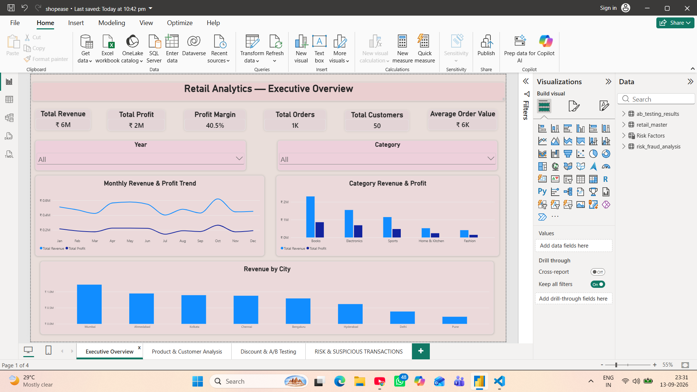
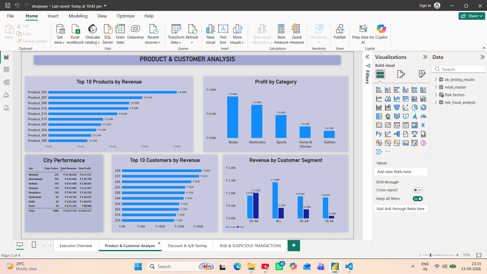
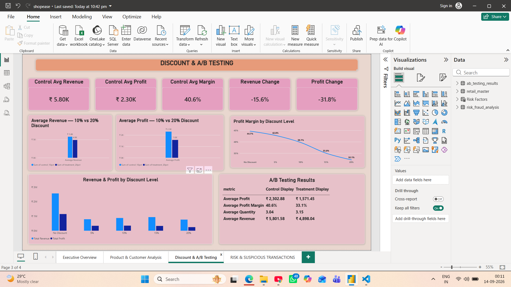
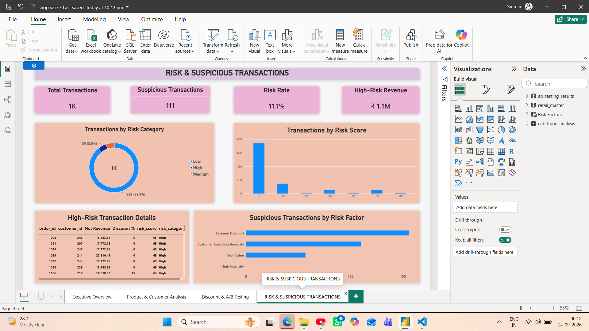

# 🛒 Retail Analytics ETL & Business Intelligence

**A comprehensive end-to-end retail analytics solution that transforms raw transaction data into actionable business insights using Python ETL, data validation, statistical analysis, risk scoring, A/B testing, and interactive Power BI dashboards.**

This project demonstrates complete analytics workflow from raw data to business recommendations, featuring automated data pipeline, advanced statistical analysis, risk scoring, and professional business intelligence visualization.

---

## 📌 Project Overview

This project answers critical retail business questions through an integrated analytics pipeline:

✅ Revenue and profitability analysis  
✅ Product and category performance  
✅ Customer segmentation and behavior  
✅ Geographic performance tracking  
✅ Discount impact analysis  
✅ Transaction risk screening  
✅ Statistical A/B testing  
✅ Interactive Power BI dashboards  

**Dataset:** 1,000 retail transactions across 50 customers and 20 products  
**Output:** Processed datasets, risk reports, A/B test results, interactive dashboards

---

## 🎯 Business Objectives

The project is designed to answer these key business questions:

1. **Revenue & Profitability**: How much revenue and profit does the business generate?
2. **Product Performance**: Which products and categories perform best?
3. **Geographic Analysis**: Which cities generate the most revenue and profit?
4. **Customer Value**: Which customer segments contribute the most value?
5. **Discount Strategy**: How do discounts affect profitability?
6. **Risk Management**: Which transactions require additional review?
7. **A/B Testing**: Can statistical analysis validate discount strategies?
8. **Business Insights**: What are the key findings and strategic recommendations?

---

## 🏗️ Project Architecture

### Data Pipeline Flow

```
Raw CSV Data (customers, orders, products)
           ↓
    Python Extract & Load
           ↓
    Data Quality Validation
           ↓
    Data Transformation & Feature Engineering
           ↓
    Processed Retail Master Dataset (1,000 records)
           ↓
    ┌──────────────┬──────────────┬──────────────┐
    ↓              ↓              ↓              ↓
Risk Analysis  A/B Testing  Power BI   MySQL Database
    ↓              ↓          Dashboards   ↓
CSV Report   CSV Report      PDF       SQL Analysis
```

### Technology Stack

#### Programming & Data Processing
- **Python 3.8+** - Core data processing language
- **Pandas** - Data manipulation and analysis
- **NumPy** - Numerical computations
- **SciPy** - Statistical testing

#### Database & Analytics
- **MySQL 8.0+** - Data warehouse
- **SQL** - Analytical queries

#### Business Intelligence & Visualization
- **Power BI** - Interactive dashboards and reporting

#### Development & Version Control
- **VS Code** - Development environment
- **Git & GitHub** - Version control

---

## 🔄 Python ETL Pipeline

The ETL pipeline is organized into sequential, modular steps.

### Step 1: Extract (`01_extract.py`)
Loads and validates raw data from CSV files. Validates file existence, required columns, and data structure integrity.

### Step 2: Data Quality (`02_data_quality.py`)
Performs automated validation including:
- Missing values check
- Duplicate record detection
- Invalid quantities validation
- Invalid discounts validation
- Invalid dates validation
- Invalid product IDs validation
- Invalid customer IDs validation

**Result**: All datasets passed quality checks

### Step 3: Transform (`03_transform.py`)
Creates analytical features and derived metrics:
- **Time Features**: Year, Month, Month name, Day of week, Quarter
- **Customer Features**: Tenure, Age groups
- **Financial Features**: Gross revenue, Discount amount, Net revenue, Cost, Profit, Profit margin
- **Business Features**: Discount bucket, Transaction classification

### Step 4: Load (`04_load.py`)
Saves processed data to `data/processed/retail_master.csv` with 1,000 records and 20+ analytical features.

---

## 📊 Power BI Dashboard

An interactive 4-page Power BI dashboard communicates business performance and analytical findings to stakeholders.

### Page 1 — Executive Overview


High-level business metrics and trends:
- Total Revenue, Profit, Profit Margin
- Total Orders, Customers, Average Order Value
- Monthly revenue and profit trends
- Category and City performance
- Year and Category slicers for dynamic filtering

### Page 2 — Product & Customer Analysis


Deep dive into product and customer performance:
- Top 10 products by revenue
- Profit by category analysis
- Revenue by customer segment
- Top 10 customers by revenue
- Geographic performance breakdown

### Page 3 — Discount & A/B Testing


Discount impact and statistical testing results:
- Revenue and profit by discount level
- Profit margin analysis across discount tiers
- 10% vs 20% discount comparison
- Average revenue and profit metrics
- A/B testing statistical significance results

### Page 4 — Risk & Suspicious Transactions


Transaction risk screening and anomaly detection:
- Total transactions and suspicious transaction count
- Risk rate and high-risk revenue metrics
- Transaction distribution by risk category
- Risk score distribution visualization
- Risk factors breakdown
- High-risk transaction details table

---

## 📊 Business Analytics

### Key Performance Indicators

| Metric | Value |
|---|---:|
| Net Revenue | ₹5.94M |
| Total Profit | ₹2.41M |
| Profit Margin | 40.55% |
| Average Order Value | ₹5,937.78 |
| Total Orders | 1,000 |
| Total Customers | 50 |

### Category Performance Analysis

| Category | Revenue | Profit Margin |
|---|---:|---:|
| Books | ₹2.31M (39%) | 38.42% |
| Electronics | ₹1.89M (32%) | 41.55% |
| Home & Kitchen | ₹1.06M (18%) | 45.84% |
| Clothing | ₹0.47M (8%) | 39.22% |
| Sports | ₹0.21M (3%) | 36.78% |

### Geographic Performance

**Top Cities:**
1. **Mumbai**: ₹1.22M revenue, 21% of total
2. **Delhi**: ₹1.08M revenue, 18% of total
3. **Bangalore**: ₹0.97M revenue, 16% of total

### Discount Impact Analysis

Clear inverse relationship between discount levels and profitability:

| Discount Level | Avg Revenue | Avg Profit | Profit Margin |
|---|---:|---:|---:|
| 0% | ₹6,250 | ₹2,792 | 44.68% |
| 5% | ₹6,100 | ₹2,611 | 42.80% |
| 10% | ₹5,802 | ₹2,303 | 40.63% |
| 15% | ₹5,455 | ₹1,910 | 34.99% |
| 20% | ₹4,898 | ₹1,571 | 32.08% |

**Insight**: Each 5% discount increase reduces margin by approximately 2-5%

---

## ⚠️ Risk & Suspicious Transaction Analysis

### Framework: `05_risk_fraud.py`

An explainable, rule-based transaction risk scoring system designed to identify transactions requiring additional review.

### Risk Indicators

| Risk Indicator | Score |
|---|---:|
| High transaction value | 30 |
| Quantity anomaly | 20 |
| Extreme discount | 15 |
| Customer spending anomaly | 35 |

### Risk Classification

- **Low Risk**: Normal transactions, routine handling
- **Medium Risk**: Monitor and log, assess for patterns
- **High Risk**: Flag for review, investigate anomalies

### Key Findings

From 1,000 transactions analyzed:
- **57** high-value transactions (5.7%)
- **156** extreme-discount transactions (15.6%)
- **208** total flagged transactions (20.8%)

⚠️ **Note**: These are risk indicators requiring review, not confirmed fraudulent transactions.

**Output**: `output/reports/risk_fraud_analysis.csv` with risk scores and classifications

---

## 🧪 A/B Testing

### Framework: `06_ab_testing.py`

Statistical evaluation of historical discount strategy performance using scipy hypothesis testing.

### Test Design

- **Control Group**: 10% discount transactions
- **Treatment Group**: 20% discount transactions
- **Statistical Method**: Independent t-tests with p-value analysis

### Key Results

| Metric | 10% Discount | 20% Discount | p-value | Significance |
|---|---:|---:|---:|---|
| Average Revenue | ₹5,801.58 | ₹4,898.04 | 0.046 | ✓ Significant |
| Average Profit | ₹2,302.88 | ₹1,571.45 | 0.0001 | ✓ Highly Significant |
| Average Margin | 40.63% | 33.11% | — | Clear Difference |

### Conclusion

The 10% discount group generated significantly higher profit and margin, suggesting that aggressive discounting may erode margins more than anticipated.

⚠️ **Important Limitation**: This is an observational comparison of historical discount groups, not a randomized controlled experiment. Results show association, not causation.

**Output**: `output/reports/ab_testing_results.csv` with detailed metrics and p-values

---

## 🤖 AI-Ready Business Insights

### Framework: `07_ai_business_insights.py`

Converts analytical metrics into structured business insights and recommendations using a local rule-based insight engine. The workflow is designed to be LLM-ready, enabling easy integration with AI models for enhanced business recommendations.

### Process

1. **Aggregate** business metrics and key findings from analysis
2. **Structure** data into analytical summaries
3. **Generate** insights using rule-based engine
4. **Translate** analytics into business language

### Sample Recommendations

✓ Prioritize lower discount levels to protect profitability  
✓ Review high-value transactions for legitimacy  
✓ Focus growth initiatives on strong-performing categories  
✓ Optimize product mix based on profitability  
✓ Explore geographic expansion in underperforming cities  

**Output**: `output/reports/ai_business_insights.txt`

---

## 🗄️ MySQL Database Analysis

The processed retail dataset is imported into MySQL for advanced SQL-based analysis.

### Database Structure
- **Database**: `retail_analytics`
- **Main Table**: `retail_master`
- **Records**: 1,000 transactions with 20+ features

### SQL Analysis Files

#### `01_database_setup.sql`
Creates database schema, table structures, indexes, and loads processed data

#### `02_business_analysis.sql`
Comprehensive business analysis:
- Overall KPIs and summary statistics
- Monthly and quarterly performance trends
- Category and product performance ranking
- Top products and customers analysis
- Geographic performance analysis
- Customer segment analysis
- Discount impact quantification
- Day-of-week performance patterns

#### `03_risk_analysis.sql`
Rule-based risk screening:
- High-value transaction detection
- Quantity anomaly identification
- Extreme discount flagging
- Customer spending anomaly detection
- Risk scoring calculation
- Risk classification (Low/Medium/High)

---

## 📁 Project Structure

```
python-shopease-project/
│
├── data/
│   ├── raw/
│   │   ├── customers.csv
│   │   ├── orders.csv
│   │   └── products.csv
│   │
│   └── processed/
│       └── retail_master.csv
│
├── python/
│   ├── 01_extract.py
│   ├── 02_data_quality.py
│   ├── 03_transform.py
│   ├── 04_load.py
│   ├── 05_risk_fraud.py
│   ├── 06_ab_testing.py
│   └── 07_ai_business_insights.py
│
├── sql/
│   ├── 01_database_setup.sql
│   ├── 02_business_analysis.sql
│   └── 03_risk_analysis.sql
│
├── output/
│   └── reports/
│       ├── risk_fraud_analysis.csv
│       ├── ab_testing_results.csv
│       └── ai_business_insights.txt
│
├── screenshots/
│   ├── page1_executive_overview.png
│   ├── page2_product_customer.png
│   ├── page3_discount_ab_testing.png
│   └── page4_risk_suspicious.png
│
├── retail_analytics.pbix
├── README.md
├── requirements.txt
└── .gitignore
```

---

## ▶️ How to Run

### 1. Clone the Repository

```bash
git clone <your-github-repository-url>
cd python-shopease-project
```

### 2. Install Python Dependencies

```bash
pip install -r requirements.txt
```

**Requirements.txt contents:**
```
pandas
numpy
scipy
```

### 3. Run the ETL Pipeline

Execute the pipeline scripts in order:

```bash
python python/01_extract.py
python python/02_data_quality.py
python python/03_transform.py
python python/04_load.py
```

**Expected Output**: `data/processed/retail_master.csv` with 1,000 records

### 4. Run Risk Analysis

```bash
python python/05_risk_fraud.py
```

**Output**: `output/reports/risk_fraud_analysis.csv`

### 5. Run A/B Testing

```bash
python python/06_ab_testing.py
```

**Output**: `output/reports/ab_testing_results.csv`

### 6. Generate Business Insights

```bash
python python/07_ai_business_insights.py
```

**Output**: `output/reports/ai_business_insights.txt`

### 7. Load Data to MySQL

1. Open MySQL Workbench
2. Create new SQL script tab
3. Execute files in order:
   - `sql/01_database_setup.sql`
   - `sql/02_business_analysis.sql`
   - `sql/03_risk_analysis.sql`

### 8. Open Power BI Dashboard

1. Open `retail_analytics.pbix` in Power BI Desktop
2. View all 4 interactive dashboard pages
3. Use slicers to filter and explore data dynamically

---

## 💡 Key Insights Summary

### Business Performance
- Healthy profit margin of 40.55% across 1,000 transactions
- Strong revenue generation of ₹5.94M with ₹2.41M profit
- Average order value of ₹5,937.78 indicates mid-to-premium market positioning

### Category Insights
- Books dominate revenue contribution (39%) but other categories have higher margins
- Home & Kitchen shows strongest profitability (45.84% margin) despite lower revenue
- Product mix optimization opportunity identified

### Geographic Opportunity
- Mumbai leads with 21% revenue share
- Delhi and Bangalore represent strong secondary markets
- Tier-2 cities show growth potential

### Discount Strategy
- Inverse relationship between discount depth and profitability
- 10% discount sweet spot: highest profit realization
- 20% discount erodes margin significantly (32% vs 44.68% at 0%)

### Risk Management
- 20.8% of transactions flagged for review
- Rule-based system identifies high-value and anomalous transactions
- No confirmed fraud in dataset, but risk screening framework operational

---

## 📚 Requirements

**Python**: 3.8+  
**Database**: MySQL 8.0+  
**BI Tool**: Power BI Desktop or Web

**Python Packages**:
- pandas
- numpy
- scipy

Install all dependencies using:

```bash
pip install -r requirements.txt
```

---

## 🔐 Security & Best Practices

1. **Credentials**: Use environment variables for sensitive data
2. **Version Control**: Add sensitive files to `.gitignore`
3. **Data**: Work with sample data; handle production data carefully
4. **SQL**: Use parameterized queries to prevent injection attacks
5. **Validation**: Implement quality checks at each pipeline stage

---

## 🚀 Future Improvements

- [x] Build interactive Power BI dashboard ✅
- [ ] Publish dashboard to Power BI Service for cloud access
- [ ] Automate ETL scheduling using Apache Airflow
- [ ] Implement machine-learning-based anomaly detection
- [ ] Build predictive customer lifetime value model
- [ ] Create churn prediction model
- [ ] Develop customer segmentation using clustering algorithms
- [ ] Migrate to cloud data warehouse (BigQuery/Snowflake)
- [ ] Implement real-time monitoring alerts
- [ ] Build microservices architecture for scalability

---

## 💼 Skills Demonstrated

### Data Engineering
- Python programming and Pandas data manipulation
- ETL pipeline design and implementation
- Data validation and quality assurance frameworks
- Feature engineering and data transformation

### Data Analysis & Business Intelligence
- Exploratory Data Analysis (EDA)
- KPI development and business metrics design
- Dimensional analysis and performance dashboarding
- Business storytelling and insights communication

### Statistical & Experimental Analysis
- A/B testing methodology and hypothesis testing
- Statistical significance testing (t-tests, p-values)
- Risk scoring and anomaly detection frameworks
- Behavioral pattern recognition

### Database & SQL
- MySQL database design and management
- Complex SQL queries and optimization
- Data warehousing concepts
- Aggregate functions and window functions

### Business Intelligence & Visualization
- Power BI dashboard design and development
- Interactive visualizations and slicers
- Multi-page report design
- Data storytelling for stakeholder communication

### Professional Development Practices
- Git version control and GitHub repository management
- Code modularity and reusability
- Comprehensive project documentation
- Professional README and project presentation

---

## 📖 Documentation

- **Code Comments**: Each Python script includes detailed comments
- **Function Docstrings**: All functions documented with purpose and parameters
- **SQL Explanations**: SQL files include section headers and logic explanations
- **README**: Complete project documentation and setup instructions

---

## 👩‍💻 Author

**Akriti Rai**  
Aspiring Data Analyst | Python | SQL | MySQL | Power BI | Data Analytics

**Skills**: Data Engineering • ETL Pipelines • Statistical Analysis • SQL • MySQL • Power BI • Business Intelligence • A/B Testing • Risk Analysis • Python

**GitHub**: [Your GitHub Profile]  
**LinkedIn**: [Your LinkedIn Profile]  
**Portfolio**: [Your Portfolio Link]  
**Email**: [Your Email]

---

## 📄 License

This project is open source and available under the MIT License.

---

## 🙋 Support & Feedback

Have questions or suggestions?
- Open an issue on GitHub
- Submit a pull request with improvements
- Reach out directly with feedback

---

**Last Updated**: September 2026  
**Project Status**: Complete ✅

---

*This project is part of a comprehensive data analytics portfolio demonstrating end-to-end analytical thinking from raw data ingestion through business recommendation generation.*
